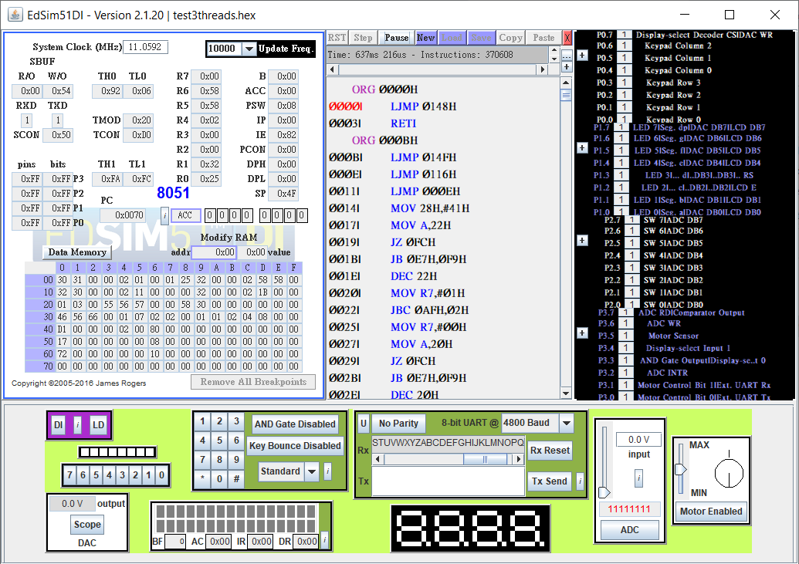

# CS3423 Operating System 2019 PPC4 Report
## ID: 106062119 Name: 王元廷  

### Overview  
In this checkpoint, I simply modified *testpreempt.c* in **ppc3** to make it become the two-producers, one-consumer example as description.  

The following functions/macros are not modified in this checkpoint:  
  - SAVESTATE: same as **ppc1**
  - RESTORESTATE: same as **ppc1**
  - SemaphoreCreate(s, n): same as **ppc3** 
  - SemaphoreWait(s): same as **ppc3**
  - SemaphoreSignal(s): same as **ppc3**
  - ThreadCreate(FunctionPtr fp): same as **ppc1**
  - ThreadYield(void): same as **ppc1**
  - Consumer(): same as **ppc3**
  - _sdcc_gsinit_startup(void): same as **ppc1**
  - _mcs51_genRAMCLEAR(void): same as **ppc1**
  - _mcs51_genXINIT(void): same as **ppc1**
  - _mcs51_genXRAMCLEAR(void): same as **ppc1**
  - timer0_ISR(void) __interrupt(1): same as **ppc2**

### 1. test3threads.c  

To implement the two-producers, I make use of the ```Producer()``` function in *testpreempt.c* of **ppc3**, with only a few lines slightly modified.  
```c
// Producer1() is the same as Producer() in ppc3
// The following is Producer2(), 
// which is slightly modified version of Producer() in ppc3
// (The modified lines is commented with explanations)
void Producer2(void){
    num = '0';                  // output '0' to '9' instead of 'A' to 'Z'
    while (1) {
        SemaphoreWait(empty);
        
        __critical{
            SemaphoreWait(mutex);
            buf[head] = num;
            head = (head == 2) ? 0 : head + 1;
            SemaphoreSignal(mutex);
        }
        
        SemaphoreSignal(full);
        num = (num == '9') ? '0' : num+1;       // return when num reaches '9' instead of 'Z'
    }
}
```

Then, *main* spawn the two producers function in the following order:  
```c
    //ThreadCreate(Producer);
    ThreadCreate(Producer1);    // 'A' to 'Z' goes first
    ThreadCreate(Producer2);    // '0' to '9' goes second
```

Surprisingly, UART only outputs *Producer1*'s output (as screenshot below).  

  

If we change the order of spawning threads in *main* to become:
```c
    //ThreadCreate(Producer);
    ThreadCreate(Producer2);    // '0' to '9' goes first
    ThreadCreate(Producer1);    // 'A' to 'Z' goes second
```

In this order, UART only outputs *Producer2*'s output (as screenshot below).  


### 2. Fairness

Clearly, it is not intuitively fair for multitasking in the above implementation.  
In order to make the scheduling policy more fair, in *test3threads.c*, I make each producer explicitly do ```ThreadYield()``` after one iteration of while-loop.    
```c
void Producer1(void){       // 'A' to 'Z'
    while (1) {
        // 1. wait for semaphore 'empty' and 'mutex'
        // 2. put output in buffer
        // 3. signal semaphore 'full'

        ch = (ch == 'Z') ? 'A' : ch+1;  // update output
        ThreadYield();                  // yield to make fair
    }
}

void Producer2(void){       // '0' to '9'
    while (1) {
        // 1. wait for semaphore 'empty' and 'mutex'
        // 2. put output in buffer
        // 3. signal semaphore 'full'

        num = (num == '9') ? '0' : num+1;  // update output
        ThreadYield();                  // yield to make fair
    }
}
```

After the above modifications, the UART output become much more fair than the previous implementation.  
If ```Producer1()``` get spawned first in ```main()```, 'A' will be the first output, while the two threads get to output in a REAL round-robin policy (as screenshot below).  

  

If ```Producer2()``` get spawned first in ```main()```, '0' will be the first output; still, the two threads get to output in a REAL round-robin policy (as screenshot below).  

  

In the above implementation, the two producers get to output in a fair scheduling policy. The UART output has become an intuitive round-robin scheduling output as we expected.

> Note: After I have finish ppc5, there is another way to implement another fair scheduling policy in ppc4. That is, we can make use of the delay() function in ppc5, and make each producer delay for a while before it put another output in buffer. Yet, that implementaion does not come out in my mind at the time I do ppc4.
