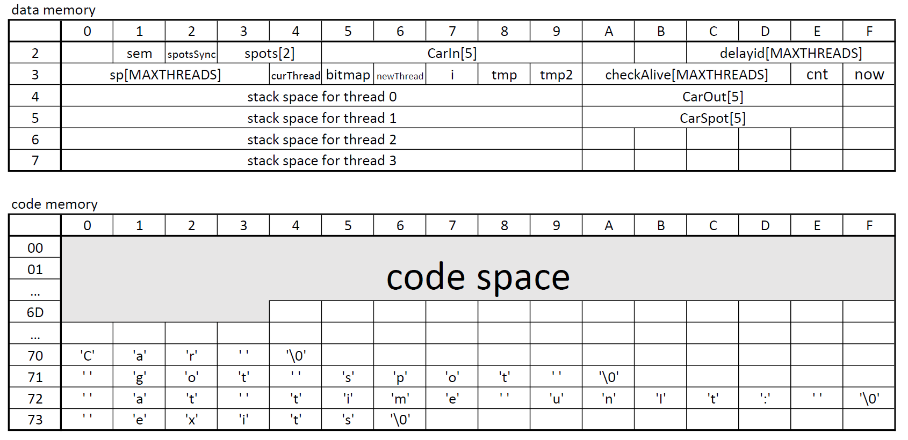
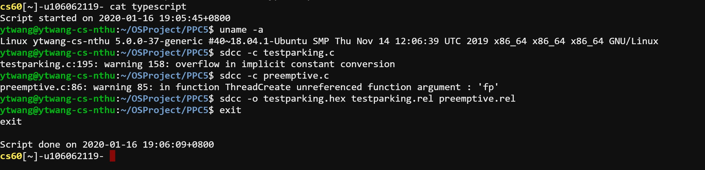
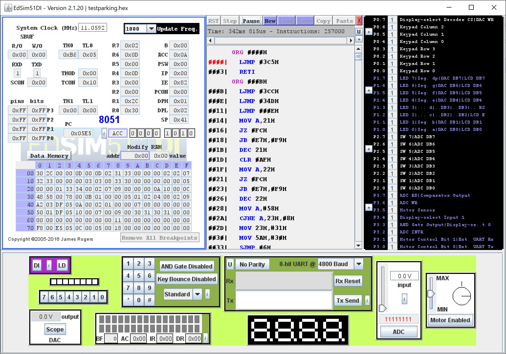
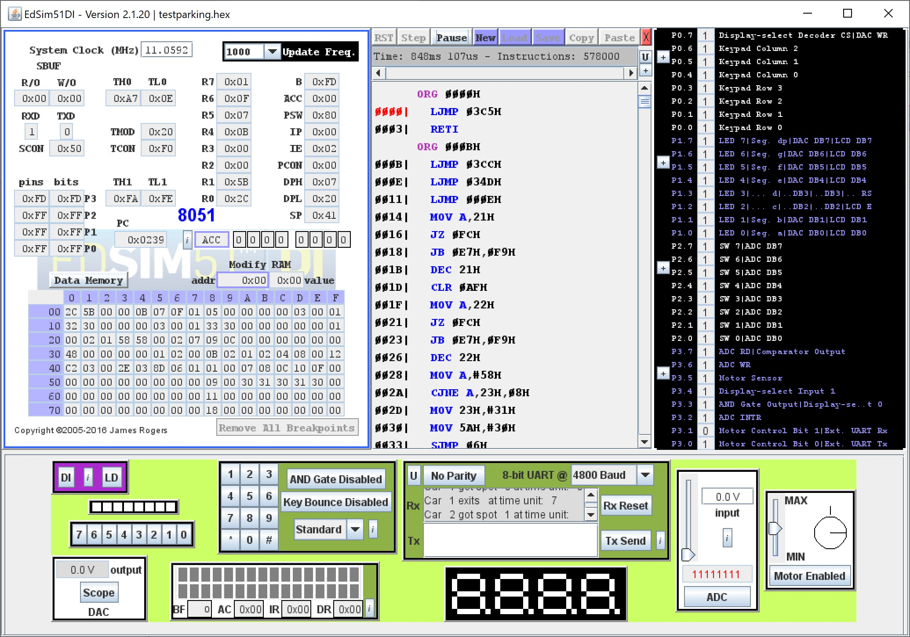
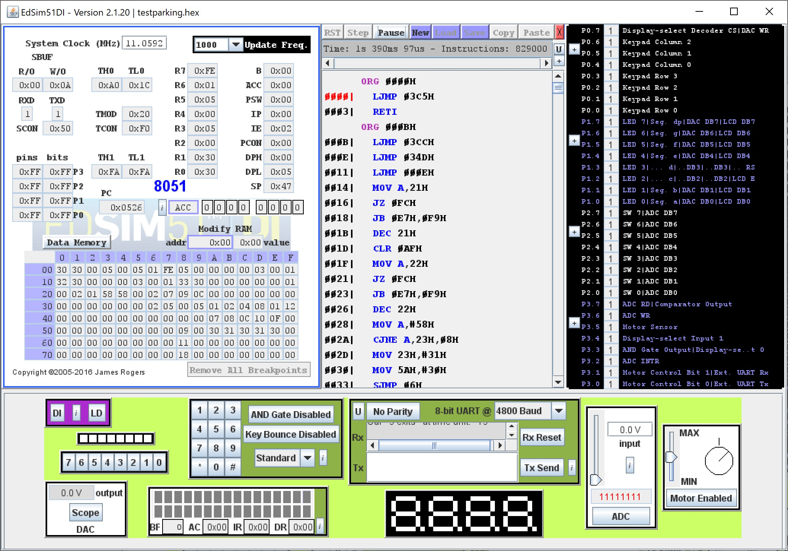
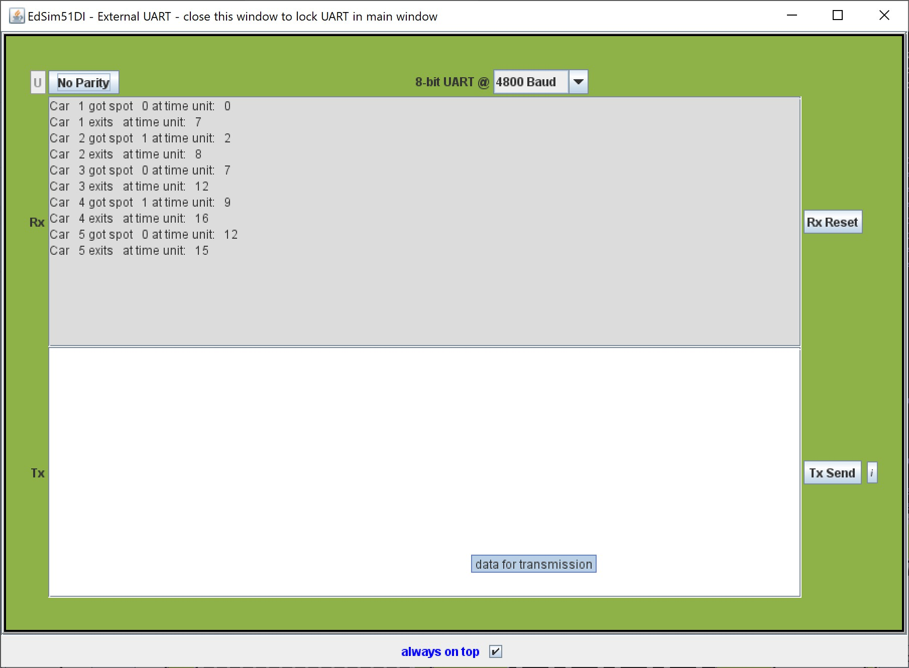

# CS3423 Operating System 2019 PPC5 Report
## ID: 106062119 Name: 王元廷  

### Overview  
In this project, I have implemented the parking lot simulation example of 5 cars and 2 available spots in EdSim51. The waiting time and parking time of each car in this project are fixed (through the function delay()), so the result should be consistent.  

The following functions/macros are not modified in this checkpoint:  
  - SAVESTATE: same as **ppc1**
  - RESTORESTATE: same as **ppc1**
  - SemaphoreCreate(s, n): same as **ppc3** 
  - SemaphoreWait(s): same as **ppc3**
  - SemaphoreSignal(s): same as **ppc3**
  - ThreadCreate(FunctionPtr fp): same as **ppc1**
  - ThreadYield(void): same as **ppc1**
  - _sdcc_gsinit_startup(void): same as **ppc1**
  - _mcs51_genRAMCLEAR(void): same as **ppc1**
  - _mcs51_genXINIT(void): same as **ppc1**
  - _mcs51_genXRAMCLEAR(void): same as **ppc1**
  - timer0_ISR(void) __interrupt(1): same as **ppc2**

Other functions/macros are either new or slightly modified compared to **ppc4**, I would make detailed explanation of those functions/macros in the sections below.

The following is the memory assignment in this project checkpoint:  

  

I would explain several key points of the implementation in details at the sections below.  

### 1. delay(n) and now()  
To implement delay(n) function, I set up two new global variables and an unsigned char array:  
```c
    __data __at (0x3E) unsigned char cnt;      // a quarter time unit
    __data __at (0x3F) unsigned char now;      // a time unit
    __data __at (0x2C) unsigned char delayid[MAXTHREADS];
```
Then, when each time *myTimer0Handler(void)* is called, **cnt** will be incremented by **1**. Every four times *myTimer0Handler(void)* is called, **now** will be incremented by **1** and **cnt** will be flushed to **0**.  
```c
void myTimer0Handler(void) {
    // ...
    // ...after switching threads

    cnt++;
    if(cnt==4) {
        cnt = 0;
        now++;
    }

    // ...restore the register values
    // ...
}
```
Finally, *delay(n)* function is implemented as:  
```c
void delay(unsigned char n) {
    delayid[curThread] = now + n;       // save the exit time
    while(now != delayid[curThread]);   // wait until now == exit time
    delayid[curThread] = 0;             // reset
}
```

Since there are at most four threads in this project, there are at most four *delay()* being called simultaneously. So, I set up an array of four unsigned char to keep track of when *delay()* of each thread should exit. The timer-0 ISR can thus support multiple *delay()* calls.

As for case that all *delay()* finish at the same time, we need to make all threads have chances to finish *delay()* at the same time unit, the length of a time unit has to be at least four interrupts to bound the worst-case completion time to be less than **(n+1)**.


Therefore, the time unit I choose is related to the interrupt interval of switching threads but not actual time units (e.g. seconds, milli-seconds...). The length of one time unit in my project equals to four interrupt intervals of timer0. I would like to note that in my implementation of *delay(n)*, it actually delays for at least **n** time units and less than **(n+1)** time units, instead of "less than **(n+0.5)**" time units which is recommended in the description. However, it is for efficiency purpose of my implementation. In fact, I can set every **cnt** to be **1/8** time units and make **now** to increment every **8** interrupts. Then, we do nothing when **cnt** is between **5** and **8** to make *delay(n)* bounds to "less than **(n+0.5)** time units, yet that would be less efficient.

Besides, **now** is actually implemented simply by an unsigned char in my project. If a function for *now()* is required, we can simply return the value in the function, as shown below:  
```c
unsigned char now(void) {
    return now;         // 'now' in this line is at (0x3F) of data memory
}
```

### 2. Robust Thread Termination and Creation
In previous checkpoints, there is no need for us to really implement the *ThreadExit* function. For this checkpoint, there are five cars to go and we have only four threads, so the thread termination function becomes necessary to implement.   
The code and explanation (as comments) of my *ThreadExit* function is as follows.
```c
void ThreadExit(void) {
    EA=0;                   // disable interrupt when terminate thread
        __asm               // reset stack to 0s (for debug) 
        mov A, #0           // >> so we can clearly see whether 
        push A              // >> a thread is terminated or not
        push A 
        push A 
        push A
        push A
        push A
        push A
        push A
        __endasm; 
        
        sp[curThread] = 0;          // reset stack pointer
        bitmap &= ~(1<<curThread);  // update bitmap
        if(bitmap == 0){            // if it is the last thread
            while(1){};             // then enter infinite loop
        }
        
        do {                        // switch to the next ready thread
            curThread = (curThread == MAXTHREADS-1) ? 0 : curThread+1;
            if(bitmap & checkAlive[curThread]) break;
        } while (1);
        RESTORESTATE;
    EA=1;                   // enable interrupt after terminate and switch thread
}
```

To make sure we will not try to create the fifth thread when there is already four threads running, I place the following code in *main* instead of implementing semaphores as in description:
```c
void main(void) {
    //...
    //...after initialization

    ThreadCreate(Car1);
    do{ delay(2); } while(bitmap==0x0F);
    ThreadCreate(Car2);
    do{ delay(2); } while(bitmap==0x0F);
    ThreadCreate(Car3);
    do{ delay(2); } while(bitmap==0x0F);
    ThreadCreate(Car4);
    do{ delay(2); } while(bitmap==0x0F);
    ThreadCreate(Car5);

    //...print the result to UART
    //...
}
```
By the line ```do{ delay(2); } while(bitmap==0x0F);``` *main* itself will keep calling ```delay(2)``` whenever the number of threads is full. Hence, we ensure the maximum limit of four threads running in this project.  

Finally, *ThreadCreate* function is not modified, it stays the same as in **ppc1**.


### 3. Parking Lot Example

Having robust *delay(n)* and *ThreadExit()* functions, we can then implement the parking lot simulation example.  
To begin, we create more global variables and initialize them in *main*:  
(The names of variables are from the Python version in Assignment 8, Part 2)  
```c
    
    __data __at (0x21) Semaphore sem;       // semaphore for available spots
    __data __at (0x22) Semaphore spotsSync; // mutex for spot sync
    __data __at (0x23) char spots[2];       // there are 2 spots available

    // the following global variables are for UART output
    __data __at (0x25) unsigned char CarIn[5];      // the time each car get spot
    __data __at (0x4A) unsigned char CarOut[5];     // the time each car exits
    __data __at (0x5A) unsigned char CarSpot[5];    // the spot each car parks at

    // Observation: after assemble testpaking.hex the last instruction is at 0x6D3 
    // of the code memory, so we put these static output chars at 0x700 to 0x730 
    // of the code memory (it should not affect any parts of our program)
    __code __at (0x700) char Car[5] = "Car ";
    __code __at (0x710) char GotSpot[11] = " got spot ";
    __code __at (0x720) char TimeUnit[16] = " at time unit: ";
    __code __at (0x730) char ExitSpot[7] = " exits";

    // initialize the semaphores and spots
    void main(void) {
        EA=0;
            spots[0] = spots[1] = 'X';      // 'X' means empty
            SemaphoreCreate(sem,2);
            SemaphoreCreate(spotsSync,1);
        EA=1;

        // ....
    }
```

Then, we create five functions in **testparking.c**, *Car1*, *Car2*, *Car3*, *Car4*, and *Car5*. These functions are almost the same, only differ in the indices of arrays. Thus, I would take *Car1* as example as follows. (The explanation of code is at the comments)  

```c
void Car1(void){
    SemaphoreWait(sem);             // wait for an available spot
    
    EA=0;                           // start parking, should not interrupt
        SemaphoreWait(spotsSync);   // ensure only one can work on spot changing at any time
        if(spots[0]=='X') {         // decide which spot to park
            spots[0] = '1';
            CarSpot[0] = '0';       // save the parking spot for UART output
        } else {
            spots[1] = '1';
            CarSpot[0] = '1';
        }
        CarIn[0] = now;             // save the parking time for UART output
        SemaphoreSignal(spotsSync);
    EA=1;                           // finish parking, enable interrupt

    delay(7);                       // delay (parking) for a while
    
    EA=0;                           // start exiting, should not interrupt
        SemaphoreWait(spotsSync);   
        if(spots[0]=='1') {         // find which spot it is parking at
            spots[0] = 'X';         // leave the spot, set empty
        } else {        
            spots[1] = 'X';
        }
        CarOut[0] = now;            // save the exit time for UART output
        SemaphoreSignal(spotsSync);
    EA=1;                           // finish exiting, enable interrupt

    SemaphoreSignal(sem);           // release sem so another car can park

    ThreadExit();                   // externally call ThreadExit()

}
```
Finally, *main()* calls each *Car[1-5]* functions and wait for them to finish.  
As for the UART output, we implement it entirely in the modified *Consumer()* function. There is no *Producer* anymore and it is in fact not doing any Producer-Consumer type of things. Instead, it outputs the result in a brute-force approach through for loops. The following is part of the code:  
```c
void Consumer(void) {
    //...
    //... initialize timer1 for Tx

    for(char i=0; i<5; i++){        // for Car1 to Car5
        
        //... some brute-force UART output ...

        // output " got spot "
        for(char j=0; j<11; j++) {
            SBUF = GotSpot[j];
            while(!TI);
            TI = 0;
        }

        // output the spot that Car[i+1] parks at
        SBUF = CarSpot[i];
        while(!TI);
        TI = 0;

        // output " at time unit: "
        for(char j=0; j<16; j++) {
            SBUF = TimeUnit[j];
            while(!TI);
            TI = 0;
        }

        //... some brute-force UART output ...
    }

```

The UART output is shown at the Screenshots section below.  

### 4. Typescript and ScreenShots
The typescript is attached in the .zip file, it should look like the following:  



Screenshot1:  
When **now** is 09 and **cnt** is 02, Car 3 and 4 are parking at spot 0 and 1 respectively.




<br><br><br><br><br><br><br><br><br><br><br><br><br><br><br><br><br><br><br><br>
Screenshot2:  
*main* calls ```Consumer()``` and is printing results to UART. (Only thread 0 is running now)



<br><br><br><br><br><br><br><br><br><br><br><br><br><br><br><br><br><br><br><br>
Screenshot3:  
After printing, *main* calls ```ThreadExit()``` and the program enters an infinite loop.  



<br><br><br><br><br><br><br><br><br><br><br><br><br><br><br><br><br><br><br><br>
Screenshot4:  
The output of UART, since the delay time is fixed, this result should be consistent.  

